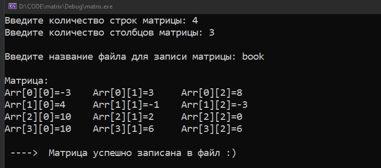
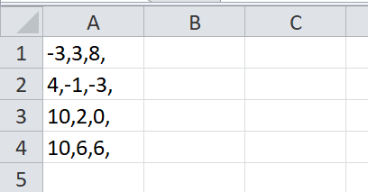
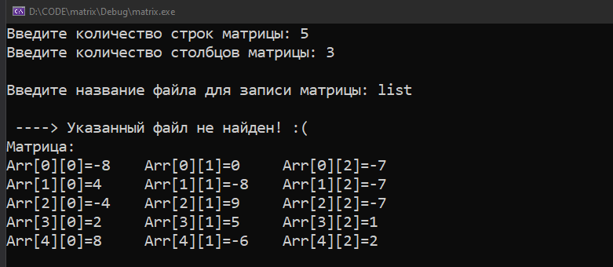

Программа сохраняет матрицу в файл

Консольная программа написана на C++

Программный код в файле main.cpp

Debug/matrix.exe - исполняемый файл

book.csv - файл куда будет записана матрица

Также предоставлена блок-схема в файле Block_schema.pdf

